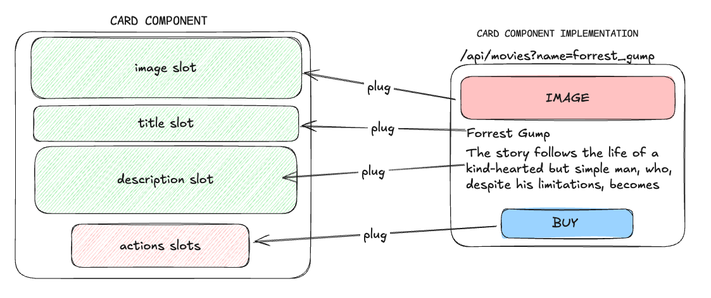

# @burning89/react-slots-tools

Hook for named slots from react `children` special prop, (similar to Vue/Svelte/Web Components)..

## Install

```bash
npm i @burning89/react-slots-tools
# or
pnpm add @burning89/react-slots-tools
# or
yarn add @burning89/react-slots-tools
```

`react-slots-tools` customize slots in your components more semantically and improves composability

- Lightweight
- Composability with ease
- Type-safety
- Intuitive API
- name slots (with parameters)
- Self-documenting with typescript

### Why Not Just Use Props?

First it should be clear that this library does not restrict the use of render props. The problem with render
props is that they reduce composability, with react-slots-tools your components will have a more natural appearance
or similar to the DOM syntax and you will also be able to pass parameters from the parent slot to the child slot.

## Usage

- Recognize `slot` y `"parent-slot"`.
- All child **without name** belongs `default` slot.
- Return arrays to suppport **many childs by slot**.

### Overview



### Using the get method of the API:

```tsx
import * as React from "react";
import { useSlots } from "@burning89/react-slots-tools";

/* describes the supported slot names along with "default" */
type ExposedSlotsType = "image" | "title" | "description" | "actions";

function Card({ children }: { children: React.ReactNode }) {
  const { get } = useSlots<ExposedSlotsType>(children);

  return (
    <div>
      <header>{get("image", )}</header>
      <section>{get("title")}</section>
      <body>{get("description")}</body>
      <footer>{get("actions")}</footer>
      <!-- type-safety -->
      <footer>{get("other-slot")}</footer> //Warning: Property 'other-slot' does not exist on type 'ExposedSlotsType'
    </div>
  );
}
```

### Using the generated slots: (Recommended)

```tsx
import * as React from "react";
import { useSlots } from "@burning89/react-slots-tools";

/* describes the supported slot names along with "default" */
type ExposedSlotsType = "image" | "title" | "description" | "actions";

function Card({ children }: { children: React.ReactNode }) {
  const { slots } = useSlots<ExposedSlotsType>(children);

  return (
    <div>
      <header>{slots.image as React.ReactNode}</header>
      <section>{slots.title as React.ReactNode}</section>
      <body>{slots.description as React.ReactNode}</body>
      <footer>{slots.actions as React.ReactNode}</footer>
      <!-- type-safety -->
      <span>{slots.nav}</span> // Warning: Property 'nav' does not exist on type 'ExposedSlotsType'
    </div>
  );
}

//...Using the Card component
import { Card } from "....";

export default function MovieDetails() {
  const movie = await fetch('/api/movies?name=forrest_gump').json();// This fetch request is just an example...
  // Let's imagine that this would be the response from the API.
  /*
    movie = {
      name: 'Forrest Gump',
      synopsis: 'The story follows the life of a kind-hearted but simple man...',
      year: 1994,
      synopsis: 'Robert Zemekis',
    }
  */

  return (
    <Card>
      <h1 slot="image"> //plugging your customization into the exposed slot
        
      </h1>
      <section>
        <p slot="title"> {movie.name} </p> //plugging your customization into the exposed slot
        <p parent-slot="description">{movie.synopsis}</p> // plugging your customization into the exposed slot
      </section>
      <span parent-slot="actions"> //plugging your customization into the exposed slot
        <button> BUY </button>
      </span>
    </Card>
  );
}
```

### Using slot with exposed parameters (TemplateSlot & SlotWithParameters):

Let's imagine in the previous example that we need to get the movie details in the parent component `<Card>`
and we want to customize the title and description.

```tsx
import * as React from "react";
import { useSlots, SlotWithParameters } from "@burning89/react-slots-tools";

type ExposedSlotsType = "image" | "title" | "description" | "actions";

function Card({ children }: { children: React.ReactNode }) {
  const movie = await fetch('/api/movies?name=forrest_gump').json();// This fetch request is just an example...

  const { slots } = useSlots<ExposedSlotsType>(children);

  return (
    <div>
      <header>{slots.image as React.ReactNode}</header>
      <section>
        <div>
          {(slots.title as SlotWithParameters)({ ...movie })}
        </div>
      </section>
      <body>
        <div>
          {(slots.description as SlotWithParameters)({ ...movie })}
        </div>
      </body>

      <footer>{slots.actions as React.ReactNode}</footer>
      <!-- type-safety -->
      <span>{slots.nav as React.ReactNode}</span><!-- Warning: Typescript error because nav slot is not typed in ExposedSlotsType -->
    </div>
  );
}

import { TemplateSlot } from "@burning89/react-slots-tools";

export default function MovieDetails() {
  type MOVIE_TYPE = {
    name: string;
    synopsis: string;
    year: number;
    author: string;
  }

  return (
    <Card>
      <h1 slot="image"></h1>
      <section>
        <TemplateSlot<MOVIE_TYPE> parent-slot="title">
          {(movie) => (
           <h2>
              {movie.name} - {movie.year}
            </h2>
          )}
        </TemplateSlot>
        <TemplateSlot<MOVIE_TYPE> parent-slot="description">
          {(movie) => (
              <p style="color: blue">
                {movie.author}: </br>
                {movie.synopsis}
              </p>
          )}
        </TemplateSlot>
      </section>
      <span parent-slot="actions"> <button> BUY </button> </span>
    </Card>
  );
}
```

### Limitations:

(Only since version 0.2.0)
Note that when you use the `slots` API in the JSX, you must narrow it down using the `as`, for example:

```tsx
{
  slots.title as React.ReactNode;
}
```

```tsx
{
  (slots.description as SlotWithParameters)({ ...movie });
}
```

This is due to the internal behavior of this library, which needs to identify whether the slot is just a
ReactNode or a TemplateSlot that can expose parameters.

## API

```ts

type SlotWithParameters = <T>(data?: T) => (data?: T extends Record<string, any> ? T : any) => React.ReactNode;

type NamedSlotsMap<T extends string> = Partial<Record<T | "default", (React.ReactNode[] | SlotWithParameters)>> & {
    default: React.ReactNode[] | SlotWithParameters;
};

function useSlots<T extends string>(children: React.ReactNode): UseSlotsResult<T> {
  // return slots based on generic T keys (include 'default' slot)
  slots: NamedSlotsMap<T extends string ? T : never>;
  // get slot by name or fallback
  get(name: T | "default", fallback?: React.ReactNode): React.ReactNode;
  //check if slot exist
  has(name: T | "default"): boolean;
  // slots list by name or fallback
  list(name: T | "default"): React.ReactNode[] | SlotWithParameters;
};
```

## Scripts

- `npm run dev` → build en watch con tsup
- `npm run build` → ESM + CJS + d.ts
- `npm test` → Vitest (jsdom)

## License

MIT
